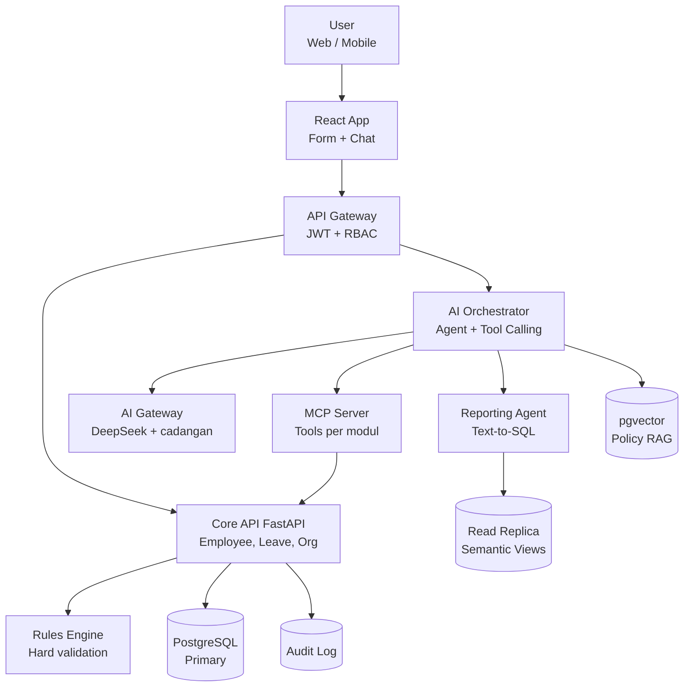
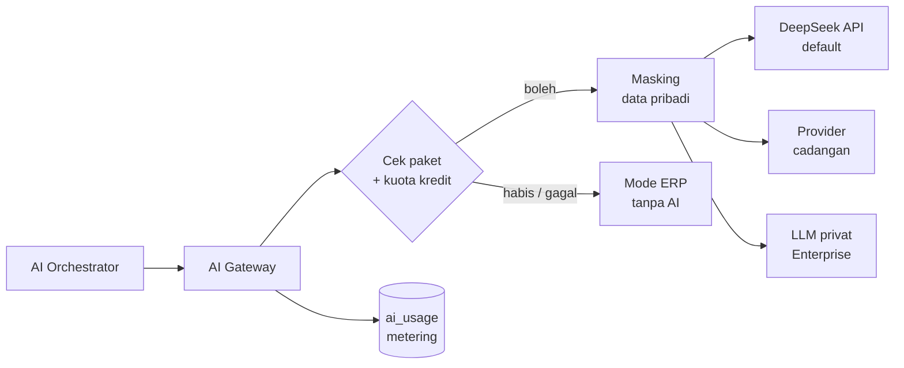
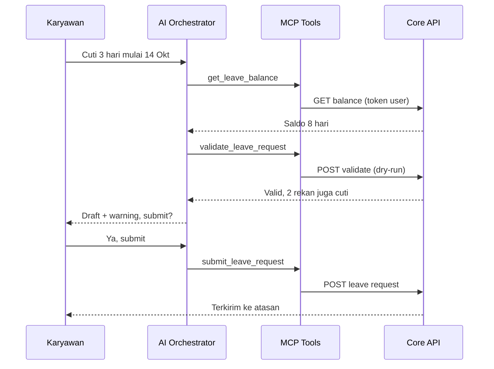
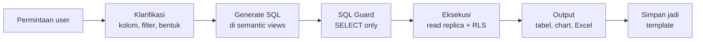
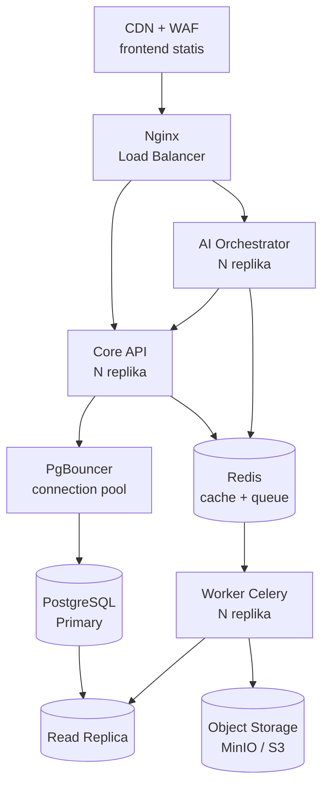
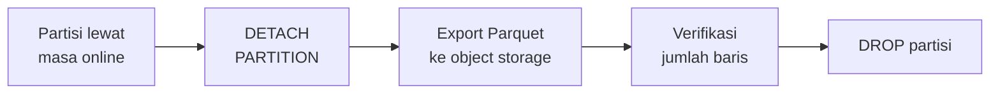
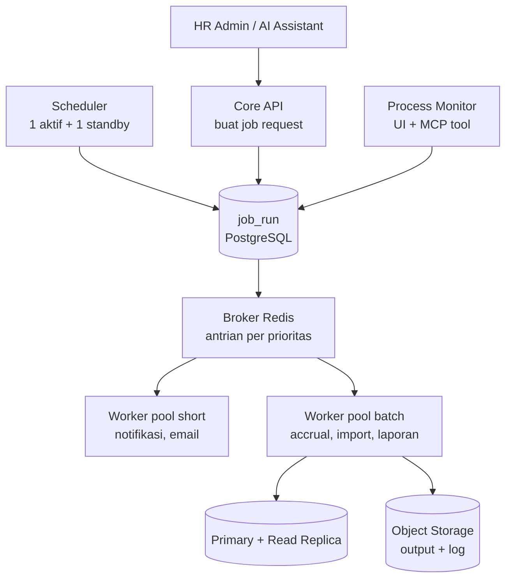

# Spec MVP — AI-Native HRIS

Sep 25, 2026 · @Fadlan

## Ringkasan produk

AI-Native HRIS adalah sistem HR di mana setiap layanan berbasis API dan bisa dipakai langsung oleh AI assistant. Karyawan cukup chat untuk cek saldo dan ajukan cuti, AI memvalidasi transaksi sebelum disimpan, dan HR bisa minta laporan custom pakai bahasa sehari-hari.

Masalah yang diselesaikan:

- Karyawan harus buka banyak menu hanya untuk cek saldo atau status pengajuan.
- Validasi form masih manual oleh HR atau atasan, lambat dan rawan salah.
- Laporan custom harus request ke IT dan butuh waktu berhari-hari.

| User | Kebutuhan utama di MVP |
| --- | --- |
| Karyawan | Cek saldo cuti, ajukan cuti, cek status, tanya aturan perusahaan via chat |
| Atasan | Approve atau reject pengajuan, lihat kalender cuti tim |
| HR Admin | Kelola data karyawan dan policy cuti, bikin laporan custom |

Asumsi target pasar: perusahaan 50 sampai 7.000+ karyawan per tenant di Indonesia, dijual sebagai SaaS multi-tenant.

Tersedia dua opsi deployment dengan codebase yang sama: SaaS multi-tenant untuk perusahaan kecil–menengah, dan dedicated (single-tenant, server sendiri) untuk klien besar atau yang butuh isolasi data penuh. Perbedaannya hanya di konfigurasi deploy, bukan di kode.

AI bersifat opsional. Tanpa paket AI, aplikasi berjalan sebagai ERP HRIS penuh. Paket AI Mini, Pro, dan Enterprise membuka fitur AI secara bertahap.

## Prinsip desain

AI adalah interface, bukan sumber kebenaran: semua angka dan keputusan final tetap dari backend yang deterministik.

1. **API-first.** Setiap fitur dibangun sebagai API dulu. UI dan AI assistant sama-sama klien dari API yang sama.
2. **Validasi dua lapis.** Hard rules (rules engine) memblokir transaksi yang melanggar aturan. AI soft validation hanya memberi warning dan saran.
3. **Permission-aware.** AI berjalan dengan token user yang login, tidak pernah pakai service account berakses penuh.
4. **Human-in-the-loop untuk aksi tulis.** AI menyiapkan draft, user wajib konfirmasi sebelum submit, approve, atau cancel.
5. **Semua bisa diaudit.** Setiap tool call AI dicatat: siapa, tool apa, parameter, hasil, dan waktu.
6. **AI opsional.** Semua fitur ERP berjalan penuh tanpa AI. Kalau paket AI tidak aktif, kuota habis, atau provider LLM gagal, aplikasi otomatis kembali ke mode ERP.

## Arsitektur sistem

Sistem terdiri dari Core API sebagai satu-satunya pintu ke data, dengan AI Orchestrator dan frontend sebagai klien.

Orchestrator tidak pernah akses database langsung, kecuali Reporting Agent ke read replica lewat view yang dikurasi.

Dua jalur utama:

- **Jalur chat:** user chat → Orchestrator pilih MCP tool → Core API dipanggil dengan token user → hasil dirangkum ke user.
- **Jalur form:** user isi form → sebelum submit, frontend panggil endpoint `validate` → rules engine (hard) dan AI (soft) → hasil tampil di form → user submit.

## Tech stack

Stack mengikuti yang sudah dikuasai (Vite + React + FastAPI) supaya fokus ke bagian AI, bukan belajar framework baru.

| Layer | Pilihan | Catatan |
| --- | --- | --- |
| Frontend | Vite + React + TypeScript + Tailwind | Chat UI dengan streaming (SSE), chart pakai Recharts |
| Core API | FastAPI + Pydantic + SQLAlchemy 2 + Alembic | OpenAPI otomatis jadi dasar MCP tools |
| AI Orchestrator | Service Python terpisah + AI Gateway (format OpenAI-compatible) | DeepSeek (deepseek-flash) sebagai default, provider lain sebagai cadangan |
| MCP Server | MCP Python SDK | Tool di-generate dari skema endpoint Core API |
| Rules Engine | Modul Python, aturan disimpan di tabel DB | Policy cuti per grade dan masa kerja bisa diubah HR tanpa deploy |
| Database | PostgreSQL + Row Level Security | Read replica khusus reporting |
| Vector store | pgvector | Satu DB dengan data utama, infra lebih ringkas |
| Job queue | Celery + Redis (broker) | Generate laporan berat dan notifikasi di background |
| Report output | pandas + openpyxl | Export Excel dan CSV |
| Observability | Langfuse (self-host) + log terstruktur | Tracing tiap percakapan dan tool call AI |
| Deploy | Docker Compose + Nginx + Let's Encrypt di VPS | Multi-replika di belakang Nginx sejak awal, naik ke Kubernetes (k3s) saat skala besar |

## Scope MVP

MVP fokus ke tiga hal yang langsung menunjukkan nilai AI: cuti via chat, validasi form otomatis, dan laporan custom.

| Modul | Fitur | Fase |
| --- | --- | --- |
| Core HR | Data karyawan, struktur organisasi, jabatan, grade (effective-dated) | MVP |
| Leave Management | Tipe cuti, saldo, accrual tahunan, pengajuan, approval berjenjang, kalender tim | MVP |
| Report builder manual | Pilih kolom, filter, dan export tanpa AI, untuk semua paket termasuk Core | MVP |
| Paket dan entitlement | Feature flag per tenant, kuota kredit AI, metering, dashboard pemakaian | MVP |
| AI Assistant | Tanya saldo, ajukan dan cancel cuti, cek status, tanya aturan perusahaan (RAG) | MVP |
| AI Form Validation | Soft validation AI di form cuti (hard validation selalu aktif) | MVP |
| Reporting Agent | Laporan tabel, chart, export Excel, simpan jadi template | MVP |
| Billing otomatis | Invoice bulanan, top-up kredit, payment gateway | Fase 2 |
| Attendance | Clock-in, shift, lembur | Fase 2 |
| Self-service lain | Reimbursement, request dokumen, update data pribadi | Fase 2 |
| Payroll | Komponen gaji, PPh21, BPJS, slip gaji | Fase 3 |
| Talent | Recruitment, performance review | Fase 3 |

## Paket AI dan monetisasi

AI dijual sebagai add-on opsional di atas lisensi ERP: tanpa paket AI semua modul tetap jalan, dan setiap paket membuka fitur AI dengan kuota kredit bulanan.

Model opt-in ini sekaligus nilai jual. Di 2026 banyak vendor HR memasukkan AI ke paket lalu menaikkan harga perpanjangan 20–37%, sehingga pembeli mulai menanyakan apakah AI benar-benar opsional ([sumber](https://tracefyhr.com/blog/hidden-costs-hr-software-add-on-fees-2026)).

| Fitur | Core | AI Mini | AI Pro | AI Enterprise |
| --- | --- | --- | --- | --- |
| Semua modul ERP, hard validation, batch | Ya | Ya | Ya | Ya |
| Laporan standar + report builder manual | Ya | Ya | Ya | Ya |
| Chat asisten karyawan (saldo, pengajuan, status) | Tidak | Ya | Ya | Ya |
| Tanya aturan perusahaan (RAG) | Tidak | Ya | Ya | Ya |
| Soft validation AI di form | Tidak | Ya | Ya | Ya |
| Reporting Agent (custom report, chart, template) | Tidak | Tidak | Ya | Ya |
| Ringkasan tim untuk atasan, rangkuman dry-run batch | Tidak | Tidak | Ya | Ya |
| Pilihan model dan LLM privat di region pilihan | Tidak | Tidak | Tidak | Ya |

| Paket | Harga usulan | Kuota kredit per bulan | Biaya LLM terburuk vs harga |
| --- | --- | --- | --- |
| Core | Lisensi ERP per karyawan (ditentukan terpisah) | 0 | 0% |
| AI Mini | $0,12 per karyawan, minimal $10 | 20 × jumlah karyawan, minimal 1.000 | ±50% |
| AI Pro | $0,30 per karyawan, minimal $30 | 40 × jumlah karyawan, minimal 3.000 | ±40% |
| AI Enterprise | Kontrak custom | Custom | Tergantung model dan hosting |

Top-up kredit $10 per 2.000 kredit. "Biaya terburuk" berarti semua kredit terpakai di jam peak. Semua harga di atas usulan awal dan divalidasi ulang setelah ada data pemakaian nyata.

Contoh: tenant 7.000 karyawan dengan AI Pro membayar $2.100 per bulan, atau ±Rp5.000 per karyawan (asumsi kurs Rp16.500). HRIS lokal kelas menengah dijual Rp25–50 ribu per karyawan per bulan dan kelas enterprise Rp50 ribu ke atas, jadi AI Pro menambah sekitar 10–20% dari harga lisensi. Vendor lain bahkan menagih custom report Rp1–5 juta per laporan, sementara di AI Pro user membuatnya sendiri ([sumber](https://albatech.id/blog/berapa-biaya-hris-indonesia-2026-panduan-harga)).

| Aksi AI | Kredit | Estimasi token | Estimasi biaya (jam peak) |
| --- | --- | --- | --- |
| 1 pesan chat (2–3 langkah tool calling) | 1 | ±15.000 input (±60% cache hit) + ±900 output | ±$0,003 |
| 1 soft validation form | 1 | ±2.000 input + ±150 output | ±$0,001 |
| 1 custom report (mode thinking) | 10 | ±20.000 input + ±5.000 output | ±$0,01 |

Hitungan memakai tarif resmi `deepseek-flash` jam peak: $0,30 per 1 juta token input (cache miss), $0,006 (cache hit), dan $1,20 output. Di luar jam peak semuanya setengah harga ([sumber](https://api-docs.deepseek.com/quick_start/pricing/)). Kredit memisahkan harga jual dari harga token, karena DeepSeek sudah dua kali mengubah skema harga di 2026, jadi rasio kredit bisa disesuaikan tanpa mengubah harga paket.

Jam peak DeepSeek (01:00–04:00 dan 06:00–10:00 UTC, Senin–Jumat) sama dengan 08:00–11:00 dan 13:00–17:00 WIB, persis jam kantor. Chat interaktif hampir selalu kena tarif peak, sedangkan job AI yang bisa ditunda (embedding, laporan terjadwal, rangkuman dry-run) dijadwalkan di luar jam itu untuk hemat 50%.

Semua panggilan LLM wajib lewat AI Gateway, tidak ada service lain yang memanggil provider langsung.

- **Entitlement:** paket dicek di backend (dependency FastAPI `require_feature`), di daftar MCP tools, dan di frontend. Menyembunyikan tombol di UI saja tidak cukup.
- **AI Gateway:** adapter format OpenAI-compatible. DeepSeek menyediakan endpoint format OpenAI dan Anthropic, dengan dukungan tool calls dan JSON output. Bisa memakai LiteLLM atau adapter sendiri.
- **Metering:** setiap panggilan mencatat tenant, fitur, model, token input/cache/output, peak atau tidak, biaya, dan kredit terpakai.
- **Kuota:** admin tenant diberi notifikasi di 80%. Di 100% fitur AI berhenti dan aplikasi kembali ke mode ERP, kecuali auto top-up aktif.
- **Graceful degradation:** provider lambat atau error → circuit breaker → provider cadangan → mode ERP. Form tetap bisa submit dengan hard validation.
- **Prompt cache-friendly:** system prompt dan definisi tool selalu di awal dan tidak berubah per request, supaya kena tarif cache hit.
- **Dashboard pemakaian:** admin tenant melihat sisa kredit, pemakaian per fitur, dan tren bulanan.

| Tabel | Isi |
| --- | --- |
| `plan` | Definisi paket: fitur, kuota per karyawan, harga |
| `tenant_subscription` | Paket aktif per tenant, periode, auto top-up |
| `feature_flag` | Override fitur per tenant (misal trial Reporting Agent) |
| `credit_ledger` | Saldo kredit: alokasi bulanan, top-up, pemakaian |
| `ai_usage` | Log per panggilan LLM, partisi bulanan |
| `ai_usage_daily` | Ringkasan harian untuk dashboard dan invoice |

Kebijakan privasi DeepSeek menyatakan data yang dikumpulkan disimpan di server di Republik Rakyat Tiongkok ([sumber](https://chat.deepseek.com/downloads/DeepSeek%20Privacy%20Policy.html)). Hal ini wajib transparan ke klien dan dimitigasi:

- **Data minimal:** hanya field yang dibutuhkan tool yang dikirim. NIK, gaji, dan rekening tidak pernah dikirim. Nama karyawan diganti token sebelum dikirim dan dikembalikan setelah respons.
- **Opt-in tertulis:** aktivasi paket AI butuh persetujuan admin tenant dan klausul pemrosesan data di kontrak, termasuk transfer data ke luar negeri sesuai UU PDP (perlu cek legal).
- **LLM privat untuk Enterprise dan dedicated:** model open-weight DeepSeek di-host sendiri atau di penyedia dengan data center pilihan, atau memakai provider lain, sehingga data tidak masuk ke server DeepSeek.
- **Klien pemerintah atau BUMN:** cek dulu kebijakan mereka soal penyedia AI asing sebelum menawarkan paket AI berbasis DeepSeek API.

Kualitas tool calling `deepseek-flash` dalam Bahasa Indonesia wajib diuji dengan eval set sebelum go-live, dan AI Gateway memungkinkan ganti model tanpa ubah kode fitur.

- [ ] Berapa harga lisensi Core (tanpa AI) per karyawan?
- [ ] Tagihan dalam USD atau Rupiah?
- [ ] Provider cadangan mana yang dipakai kalau DeepSeek bermasalah?

## AI Assistant dan validasi form

Assistant bisa baca data dan menyiapkan transaksi, tapi aksi tulis selalu menunggu konfirmasi eksplisit dari user.

Angka yang disebut AI (saldo, jumlah hari) selalu berasal dari hasil tool, tidak pernah dihitung sendiri oleh LLM.

| Jenis | Contoh aturan | Diperiksa oleh | Efek |
| --- | --- | --- | --- |
| Hard | Saldo cuti tidak cukup | Rules engine | Blokir |
| Hard | Tanggal overlap dengan pengajuan lain | Rules engine | Blokir |
| Hard | Pengajuan kurang dari batas minimal hari sebelumnya | Rules engine | Blokir (bisa dikonfigurasi) |
| Soft | Alasan terlalu singkat atau tidak jelas | AI | Warning ke pengaju |
| Soft | Banyak anggota tim cuti di tanggal yang sama | Query + AI merangkum | Warning ke pengaju dan atasan |
| Soft | Tipe cuti kurang tepat untuk alasan yang ditulis | AI | Saran tipe cuti lain |

Endpoint `validate` yang sama dipakai oleh form dan chat, jadi hasil validasi selalu konsisten di dua jalur.

## Reporting Agent

Reporting Agent mengubah permintaan bahasa biasa jadi query ke semantic views, lalu menyajikannya dalam bentuk yang diminta user.

Agent bertanya dulu kalau permintaan ambigu, misal periode, unit organisasi, atau bentuk output yang diinginkan.

- **Semantic views:** `v_employee`, `v_org_unit`, `v_leave_balance`, `v_leave_request`. Tiap kolom punya deskripsi bisnis yang dikirim ke LLM sebagai data dictionary.
- **SQL Guard:** hanya `SELECT`, hanya view yang di-whitelist, limit baris, timeout query, dan kolom sensitif di-mask sesuai role.
- **Transparansi:** setiap laporan menampilkan definisi yang dipakai (filter, periode, rumus) supaya user bisa cek kebenarannya.
- **Output:** tabel interaktif, chart (bar, line, pie), export Excel atau CSV, dan ringkasan naratif singkat.
- **Template:** laporan yang sudah benar bisa disimpan dan dijalankan ulang tanpa lewat LLM, jadi hasilnya konsisten dan hemat biaya.

## Data model inti

Data karyawan memakai pola effective-dated seperti JOB di PeopleSoft, jadi riwayat mutasi dan promosi tidak pernah ditimpa.

| Tabel | Isi utama | Relasi kunci |
| --- | --- | --- |
| `tenant` | Perusahaan klien, konfigurasi, zona waktu | Induk semua tabel (`tenant_id`) |
| `org_unit` | Divisi dan departemen, bertingkat | `parent_id`, `manager_employee_id` |
| `employee` | Data pribadi dasar, NIK karyawan, tanggal masuk | `tenant_id` |
| `employee_job` | Jabatan, grade, unit, atasan, status (effdt + effseq) | `employee_id`, `org_unit_id` |
| `leave_type` | Cuti tahunan, sakit, melahirkan, dll. | `tenant_id` |
| `leave_policy` | Jatah per grade dan masa kerja, aturan carry-over | `leave_type_id` |
| `leave_balance` | Saldo per karyawan per tipe per tahun | `employee_id`, `leave_type_id` |
| `leave_request` | Tanggal, jumlah hari, alasan, status, hasil validasi AI | `employee_id`, `leave_type_id` |
| `leave_approval` | Level approval, approver, keputusan, catatan | `leave_request_id` |
| `holiday_calendar` | Hari libur nasional dan cuti bersama | `tenant_id` |
| `app_user` / `role` | Akun login dan RBAC | `employee_id` |
| `policy_document` | Dokumen peraturan perusahaan + embedding | `tenant_id` |
| `report_template` | Laporan tersimpan: SQL, parameter, bentuk output | `created_by` |
| `ai_tool_call` | Log setiap tool call AI | `app_user_id`, `conversation_id` |
| `audit_log` | Perubahan data (before/after) | Semua tabel transaksi |

## API endpoint dan MCP tools

Setiap MCP tool adalah pembungkus tipis satu endpoint Core API, dan tool yang tersedia difilter sesuai role user.

| MCP tool | Endpoint | Role | Konfirmasi user |
| --- | --- | --- | --- |
| `get_my_profile` | `GET /me` | Semua | Tidak |
| `get_leave_balance` | `GET /leave/balances` | Semua | Tidak |
| `list_leave_requests` | `GET /leave/requests` | Semua | Tidak |
| `validate_leave_request` | `POST /leave/requests/validate` | Semua | Tidak (dry-run) |
| `submit_leave_request` | `POST /leave/requests` | Semua | Ya |
| `cancel_leave_request` | `POST /leave/requests/{id}/cancel` | Semua | Ya |
| `get_team_calendar` | `GET /leave/team-calendar` | Atasan, HR | Tidak |
| `decide_leave_request` | `POST /leave/requests/{id}/decision` | Atasan | Ya |
| `search_policy` | `POST /policy/search` | Semua | Tidak |
| `list_employees` | `GET /employees` | HR | Tidak |
| `run_report` | `POST /reports/query` | HR | Tidak |
| `save_report_template` | `POST /reports/templates` | HR | Ya |

Token JWT user ikut di setiap tool call, jadi otorisasi tetap diputuskan Core API, bukan oleh AI.

## Security, privacy, dan audit

Akses data dijaga dua lapis (RBAC di API dan Row Level Security di PostgreSQL), sehingga AI tidak pernah jadi penentu hak akses.

- **Autentikasi:** JWT per user. Orchestrator meneruskan token user (on-behalf-of), bukan memakai service account.
- **Isolasi tenant:** `tenant_id` wajib di setiap tabel dan dipaksa lewat RLS, plus test otomatis untuk kebocoran antar tenant.
- **Aksi tulis:** wajib konfirmasi eksplisit user dan memakai idempotency key supaya tidak terjadi double submit.
- **Prompt injection:** isi teks bebas (alasan cuti, dokumen policy) diperlakukan sebagai data, dan daftar tool dibatasi per role.
- **Data sensitif:** gaji, NIK KTP, dan rekening tidak masuk MVP. Nanti di-mask di semantic views sesuai role.
- **Kepatuhan:** data karyawan tunduk pada UU No. 27 Tahun 2022 tentang Pelindungan Data Pribadi. Perlu kebijakan retensi dan cek lokasi pemrosesan data oleh LLM provider.
- **Audit:** setiap tool call dan perubahan data tercatat. Riwayat percakapan AI disimpan dengan masa retensi terbatas.
- **Kontrol biaya:** rate limit per user dan batas token per tenant per bulan.

## Skalabilitas dan load balancing

Semua service dibuat stateless sejak hari pertama, sehingga kapasitas cukup ditambah dengan menambah replika di belakang load balancer.

| Metrik (1 tenant, 7.000 karyawan) | Asumsi awal |
| --- | --- |
| User aktif harian | 30–50% (2.100–3.500 orang) |
| Puncak concurrent | ±10% (±700 user), pagi hari dan menjelang cuti bersama |
| Beban terberat | Panggilan LLM (2–10 detik per respons) dan laporan besar, bukan API CRUD |
| Volume data | Kecil untuk PostgreSQL. Yang tumbuh cepat hanya `audit_log` dan `ai_tool_call` |

Semua angka di atas asumsi dan wajib divalidasi dengan load test sebelum go-live.

Load balancer tidak butuh sticky session karena state percakapan dan cache disimpan di Redis dan PostgreSQL.

| Komponen | Cara scaling | Sinyal perlu ditambah |
| --- | --- | --- |
| Core API | Tambah replika, beberapa worker uvicorn per replika | CPU > 70% atau p95 latency > 500 ms |
| AI Orchestrator | Tambah replika, streaming SSE tanpa buffering di Nginx | Koneksi SSE bersamaan tinggi |
| Worker | Tambah replika, antrian terpisah per jenis job (laporan, notifikasi, accrual) | Antrian menumpuk |
| PostgreSQL | PgBouncer, index, partisi bulanan untuk tabel log, read replica untuk laporan | Koneksi atau CPU DB tinggi |
| Redis | Cache saldo dan policy, rate limit, antrian job. Sentinel untuk failover | Memori atau latency naik |
| LLM API | Antrian + rate limit per tenant, model kecil untuk tugas ringan, cache jawaban policy | Kena rate limit provider |

Konfigurasi load balancing:

- **Algoritma:** Nginx `least_conn` ke replika Core API dan Orchestrator, karena durasi request AI sangat bervariasi.
- **Health check:** endpoint `/health` (proses hidup) dan `/ready` (DB dan Redis terhubung). Nginx open source memakai passive check (`max_fails`), Kubernetes memakai readiness probe.
- **Streaming:** `proxy_buffering off` dan timeout panjang khusus route chat.
- **Graceful shutdown:** replika yang dimatikan menyelesaikan request berjalan dulu, jadi deploy tidak memutus chat user.

| Tahap | Perkiraan skala | Infrastruktur |
| --- | --- | --- |
| 1 | Sampai ±2.000 karyawan | 1 VPS, Docker Compose, 2 replika API dan Orchestrator di belakang Nginx |
| 2 | Sampai 7.000+ karyawan atau banyak tenant | 2–3 node k3s, autoscaling (HPA), PostgreSQL di server terpisah + read replica |
| 3 | Enterprise, butuh high availability | Multi-node, PostgreSQL HA (Patroni atau managed DB), Redis Sentinel, backup lintas lokasi |

Aturan wajib sejak scaffold supaya bisa naik tahap tanpa rewrite:

- Tidak ada session, file, atau cache di memori atau disk lokal service.
- Semua konfigurasi lewat environment variable.
- Semua endpoint list wajib pagination, tidak ada yang mengembalikan 7.000 baris sekaligus.
- Job berat (accrual tahunan, laporan besar, notifikasi massal) selalu lewat worker dan idempotent.
- Load test dengan k6 atau Locust, target awal p95 < 500 ms untuk API CRUD di 700 user concurrent.

## Performa query jangka panjang

Setiap query harus dibatasi index, periode, atau partisi, sehingga kecepatannya tidak bergantung pada total data yang menumpuk bertahun-tahun.

| Tabel (1 tenant, 7.000 karyawan) | Estimasi baris per tahun | Strategi |
| --- | --- | --- |
| `leave_request` | ±70.000 | Index `(tenant_id, employee_id, start_date)` dan `(tenant_id, status)` |
| `leave_approval` | ±100.000 | Index `(tenant_id, approver_id, status)` |
| `audit_log` | ±2–5 juta | Partisi bulanan, BRIN index di `created_at` |
| `ai_tool_call` | ±4–5 juta | Partisi bulanan, retensi online pendek |
| `attendance` (Fase 2) | ±1,8 juta | Partisi bulanan |

Estimasi di atas asumsi (misal 10 pengajuan cuti per karyawan per tahun) dan dipakai untuk membuat data uji.

Aturan wajib untuk semua query, dimasukkan ke `CLAUDE.md`:

1. **Index diawali `tenant_id`.** Semua query difilter tenant, jadi composite index selalu mulai dari kolom itu.
2. **Keyset pagination, bukan OFFSET.** OFFSET makin lambat di halaman belakang. Pakai cursor berdasarkan tanggal atau id.
3. **Tidak ada `SELECT *` dan tidak ada N+1.** Pilih kolom yang dibutuhkan, pakai `selectinload` atau `joinedload` di SQLAlchemy.
4. **Default dibatasi periode.** List transaksi default tahun berjalan. Histori lama hanya lewat filter eksplisit.
5. **Saldo disimpan, bukan dihitung ulang.** `leave_balance` di-update di transaksi yang sama, tidak menjumlah seluruh histori setiap kali dibaca.
6. **Agregat pakai summary table.** Dashboard dan laporan rutin membaca materialized view atau tabel ringkasan yang di-refresh worker.
7. **Cache yang jelas invalidasinya.** Policy, struktur organisasi, dan saldo di-cache Redis, dan dihapus dari cache saat datanya berubah.
8. **Statement timeout per role DB.** Misal 5 detik untuk API dan 30 detik untuk reporting, supaya satu query berat tidak menyeret sistem.
9. **Wajib uji di data 3 tahun.** Seed generator membuat 7.000 karyawan dengan 3 tahun transaksi. Setiap query baru dicek `EXPLAIN ANALYZE` di data ini.
10. **Regresi performa di CI.** Load test k6 jalan di CI, build gagal kalau p95 naik lebih dari 20% dari baseline.

Tabel yang sering di-update (`leave_balance`, `leave_request`) mendapat setelan autovacuum lebih agresif supaya tidak bloat.

## Backup dan archiving

Backup menjamin data bisa dipulihkan, archiving menjaga tabel operasional tetap kecil dan cepat. Keduanya dijadwalkan terpisah.

| Jenis backup | Tool | Frekuensi | Retensi |
| --- | --- | --- | --- |
| Full backup fisik PostgreSQL | pgBackRest | Harian (malam) | 7 harian, 4 mingguan, 12 bulanan |
| WAL archiving (point-in-time recovery) | pgBackRest | Kontinu | 14 hari, bisa restore ke menit tertentu |
| Export per tenant | Job `COPY` per `tenant_id` | Mingguan dan saat diminta | Untuk serah data ke klien atau pindah SaaS ke dedicated |
| File (dokumen, hasil laporan) | Versioning MinIO / S3 | Kontinu | 30 hari versi lama |

Redis tidak dibackup sebagai sumber data. Cache dan antrian bisa dibangun ulang, dan status job penting juga dicatat di PostgreSQL.

- **Aturan 3-2-1:** tiga salinan, dua media, satu di lokasi lain (provider atau region berbeda), semuanya terenkripsi.
- **Target awal:** RPO ≤ 15 menit dan RTO ≤ 4 jam untuk SaaS. Untuk dedicated, target mengikuti kontrak klien.
- **Restore drill bulanan:** restore otomatis ke server staging lalu verifikasi jumlah baris dan checksum. Backup yang tidak pernah diuji restore dianggap belum ada.

| Data | Tetap online | Setelah itu | Dihapus |
| --- | --- | --- | --- |
| `ai_tool_call` dan percakapan AI | 6 bulan | Arsip ringkas 12 bulan | Setelah 18 bulan |
| `audit_log` | 12 bulan | Arsip Parquet di object storage | Sesuai kebijakan retensi |
| `leave_request` dan `leave_approval` | 3 tahun berjalan | Partisi tahunan dipindah ke arsip | Sesuai kebijakan retensi |
| `attendance` (Fase 2) | 2 tahun | Arsip Parquet | Sesuai kebijakan retensi |
| Karyawan resign | Tetap di tabel dengan status nonaktif | Data transaksinya ikut alur tabel di atas | Sesuai kebijakan retensi |

Alur archiving memakai partisi (pg\_partman), bukan `DELETE` massal:

Cara ini cepat dan tidak menimbulkan bloat. Data arsip tetap bisa dibaca untuk laporan historis lewat job khusus, misal DuckDB yang membaca file Parquet.

Pada SaaS, backup dan arsip dijalankan per cluster untuk semua tenant. Pada dedicated, tool dan jadwal yang sama dipasang di server klien lewat script deploy yang sama.

- [ ] Berapa lama masa retensi resmi untuk data cuti, audit, dan karyawan resign? Perlu dicek ke legal dan disesuaikan dengan UU PDP.

## Mode debug dan performance monitoring

Monitoring ringan selalu aktif untuk semua user, dan mode debug detail bisa dinyalakan per tenant, per user, atau per request tanpa redeploy.

| Layer | Tool | Yang dipantau |
| --- | --- | --- |
| Tracing | OpenTelemetry ke Grafana Tempo | Durasi per endpoint, per query DB, per tool call AI |
| Metrics | Prometheus + Grafana | Request per detik, latency p50/p95/p99, error rate, CPU, memori, panjang antrian worker |
| Database | `pg_stat_statements`, `auto_explain`, postgres\_exporter | Query paling lambat dan paling sering, bloat, jumlah koneksi |
| Log | Loki, log JSON dengan `request_id` dan `tenant_id` | Error dan penelusuran satu request dari ujung ke ujung |
| LLM | Langfuse | Latency, token, dan biaya per tenant |
| Alert | Grafana Alerting ke Telegram atau email | p95 di atas target, error > 1%, antrian menumpuk, disk > 80% |

Dalam kondisi normal, tracing di-sample 10% dan `auto_explain` hanya mencatat query di atas 500 ms, supaya overhead monitoring tetap kecil.

Cara menyalakan mode debug:

- **Per tenant atau per user:** flag di Redis (`debug:tenant:{id}` atau `debug:user:{id}`) dengan TTL 30 menit, jadi otomatis mati sendiri.
- **Per request:** header `X-Debug: 1`, hanya diterima dari akun super-admin.
- **Kontrol akses:** hanya super-admin yang bisa menyalakan, dan setiap aktivasi tercatat di `audit_log`.

Yang terjadi saat mode debug aktif:

- Tracing 100% untuk request yang terkena flag, dan log level naik ke DEBUG.
- Setiap request mencatat jumlah dan durasi query. Muncul warning N+1 kalau lebih dari 20 query per request.
- `EXPLAIN ANALYZE` otomatis untuk query di atas 200 ms, disimpan bersama trace-nya.
- Response membawa header `Server-Timing` (db, cache, llm, total), jadi terlihat langsung di DevTools browser.
- Panel debug di frontend khusus admin: waktu per layer, jumlah query, query terlambat, dan token LLM untuk halaman yang sedang dibuka.
- Data pribadi tetap di-mask di log dan trace, termasuk saat debug.

Pada SaaS, satu stack monitoring pusat memantau semua tenant. Pada dedicated, stack yang sama dipasang di server klien, dengan opsi mengirim metrics ke pusat jika klien setuju.

## Batch dan background process

Batch dipisah total dari web service: API hanya mencatat permintaan job, lalu scheduler dan worker yang mengeksekusi, sehingga proses berat tidak pernah memperlambat user. Konsepnya mirip Process Scheduler + Application Engine di PeopleSoft.

Tabel `job_run` di PostgreSQL adalah sumber kebenaran status job. Broker hanya jalur antrian, jadi kalau Redis restart tidak ada job yang hilang jejaknya.

| Job | Pemicu | Frekuensi | Pool |
| --- | --- | --- | --- |
| Accrual dan reset saldo cuti | Terjadwal | Harian (cek ulang tahun kerja) dan awal tahun | Batch |
| Hangus carry-over cuti | Terjadwal | Harian | Batch |
| Reminder approval tertunda dan saldo akan hangus | Event dan terjadwal | Real-time dan harian | Short |
| Laporan besar dan laporan terjadwal | User, AI, atau jadwal | Sesuai permintaan | Batch |
| Import massal (Excel karyawan, saldo awal) | User | Sesuai permintaan | Batch |
| Refresh summary table dan materialized view | Terjadwal | 15 menit sampai harian | Batch |
| Maintenance partisi dan archiving | Terjadwal | Bulanan, jam sepi | Maintenance |
| Embedding ulang dokumen policy | Event | Saat dokumen diupload | Short |
| Sinkron mesin absensi, payroll run (Fase 2–3) | Terjadwal | Harian dan bulanan | Batch |

| Tabel | Isi |
| --- | --- |
| `job_definition` | Kode job, pool, timeout, max retry, skema parameter |
| `job_schedule` | Jadwal cron, timezone, tenant, aktif atau tidak. Bisa diubah HR tanpa deploy |
| `job_run` | Status (queued, running, success, partial, failed, cancelled), parameter, pemicu, progress, output. Setara run control + process request |
| `job_run_chunk` | Status per potongan data dan checkpoint untuk restart |
| `job_run_log` | Log per langkah, terhubung ke `trace_id` |

Aturan desain job:

1. **Chunking.** 7.000 karyawan dipecah per 500 menjadi 14 chunk paralel. Satu chunk gagal tidak mengulang semuanya.
2. **Idempotent dan bisa restart.** Setiap chunk tercatat, restart melanjutkan dari chunk yang gagal, seperti restart Application Engine.
3. **Commit per chunk.** Tidak ada satu transaksi raksasa yang mengunci tabel lama dan bikin bloat.
4. **Lock per tenant dan jenis job.** PostgreSQL advisory lock mencegah accrual jalan dobel.
5. **Fair antar tenant.** Batas job bersamaan per tenant, supaya satu tenant besar tidak memonopoli worker di SaaS.
6. **Prioritas dan pool terpisah.** Antrian high (notifikasi), default (permintaan user), low (maintenance). Job berat membaca dari read replica dan dijadwalkan di jam sepi.
7. **Timeout, retry, dead-letter.** Retry dengan jeda bertahap. Job yang gagal berulang masuk dead-letter queue dan memicu alert.
8. **Dry-run.** Accrual dan import bisa disimulasikan dulu. AI merangkum hasil dry-run, HR konfirmasi, baru dijalankan sungguhan.

Process Monitor menampilkan status, progress, log, dan file output, dengan tombol retry dan cancel. AI Assistant memakai tool `run_job` (wajib konfirmasi) dan `get_job_status`, misal HR chat "jalankan ulang accrual Divisi Produksi" lalu melihat dry-run sebelum eksekusi. Mode debug juga berlaku per job run.

| Komponen | Pilihan | Alasan |
| --- | --- | --- |
| Engine | Celery 5 + Redis sebagai broker | Matang, mendukung chain dan group untuk fan-out chunk, retry, antrian prioritas |
| Scheduler | Service kustom yang membaca `job_schedule`, leader election via advisory lock | Jadwal dinamis per tenant dan timezone, tetap aman dijalankan 2 replika |
| Autoscaling worker | KEDA berdasarkan panjang antrian (tahap Kubernetes) | Worker bertambah saat antrian menumpuk, berkurang saat sepi |
| Broker skala besar | RabbitMQ (opsional, tahap 3) | Durability dan routing lebih kuat |
| Workflow panjang | Evaluasi Temporal untuk payroll (Fase 3) | Workflow multi-langkah yang tahan crash dan bisa berjalan berjam-jam |

ARQ di draft awal diganti Celery karena ARQ sekarang berstatus maintenance-only.

## Fase development dengan Claude Code

MVP realistis selesai dalam sekitar 12 minggu part-time, sejalan dengan roadmap belajar AI Agent Oktober–Desember.

| Minggu | Fase | Output |
| --- | --- | --- |
| 1 | Setup | Monorepo, `CLAUDE.md`, Docker Compose, CI, spec ini masuk folder `docs/` |
| 2–4 | Core API | Data model + migrasi, API Employee dan Leave, rules engine, framework batch job, entitlement paket, test Pytest |
| 5–6 | Frontend | Form cuti, halaman approval, kalender tim, dashboard saldo |
| 7–9 | AI Assistant | AI Gateway + metering kredit, MCP server, orchestrator, chat UI streaming, validasi form AI, RAG policy |
| 10–11 | Reporting Agent | Semantic views, SQL Guard, output tabel/chart/Excel, template |
| 12 | Hardening | Security review, eval AI, load test simulasi 7.000 karyawan, deploy, demo ke calon klien |

Cara kerja dengan Claude Code:

- **`CLAUDE.md` sebagai kontrak:** isi arsitektur, konvensi penamaan, struktur folder, dan aturan "AI tidak boleh hitung angka sendiri".
- **Spec-first:** satu modul per sesi, mulai dari skema Pydantic dan test, baru implementasi.
- **Review setiap diff:** terutama bagian otorisasi, RLS, dan SQL Guard. Bagian ini jangan di-accept tanpa dibaca.
- **Eval set AI:** kumpulkan 30–50 contoh percakapan dan permintaan laporan, jalankan ulang setiap ada perubahan prompt atau model.

## Risiko dan open questions

Risiko terbesar adalah AI memberi jawaban atau laporan yang terlihat benar padahal salah, jadi mitigasinya fokus ke transparansi dan aturan deterministik.

| Risiko | Dampak | Mitigasi |
| --- | --- | --- |
| Halusinasi saat jawab atau validasi | Info saldo atau keputusan salah | Angka selalu dari tool, hard rules deterministik, AI hanya advisory |
| Text-to-SQL salah tafsir | Laporan menyesatkan | Semantic views, tampilkan definisi yang dipakai, template tervalidasi |
| Kebocoran data antar user atau tenant | Pelanggaran privasi, hilang kepercayaan klien | RLS, token user di setiap call, test otorisasi otomatis |
| Data prompt tersimpan di server LLM luar negeri | Klien menolak AI, isu transfer data lintas negara | Opt-in per tenant, masking data pribadi, opsi LLM privat untuk Enterprise |
| Harga atau model provider berubah mendadak | Margin paket AI tergerus | Sistem kredit, AI Gateway multi-provider, review rasio kredit tiap bulan |
| Biaya LLM membengkak | Margin SaaS tergerus | Kuota kredit per paket, AI batch di jam off-peak, prompt cache-friendly, template tanpa LLM |
| Scope creep ke payroll | MVP molor | Kunci scope, payroll baru di Fase 3 |

- [ ] Dijual sebagai SaaS multi-tenant atau di-install per perusahaan (single-tenant)?
- [ ] Perlu opsi LLM self-hosted untuk klien yang ketat soal data?
- [ ] Perlu integrasi dengan sistem existing, misal PeopleSoft atau mesin absensi fingerprint?
- [ ] Channel chat cukup web, atau juga WhatsApp dan Telegram?
